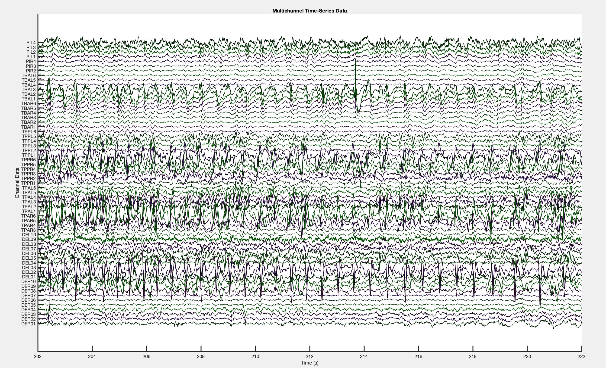

## EEG viewer

### Shortcuts:
1) `"+"` - increase the amplitude
2) `"-"` - decrease the amplitude
3) `Shift+"+"` - zoom in
4) `Shift+"-"` - zoom out
5) `up arrow` - move up
6) `down arrow` - move down
7) `right arrow` - move right
8) `left arrow` - move left

